# Preparation for git workshop
Git is a distributed version control system that allows you to track changes in your codebase, collaborate with other developers, and manage your project's history. If you learn how to use git effectively and get used to using it, it will become an invaluable tool in the development of your final project. 
Additionally, it's an **absolute necessity** for every software developer.

To save time during the workshop, it's ideal that you install all the necessary software before the workshop starts. Additionally, please create a GitHub account if you don't have one already.

## Install Visual Studio Code
Before we install git, we need to install a text editor. VS code is one that you're probably familiar with and hopefully all of you have it installed. In case you don't have it installed on your machine yet, follow the instructions below.
### MacOs
Follow the guide on the official Visual Studio Code website (section Use the macOS installer):
https://code.visualstudio.com/docs/setup/mac#_install-vs-code-on-macos
### Windows
Follow the guide on the official Visual Studio Code website (section Use the Windows Installer):
https://code.visualstudio.com/docs/setup/windows#_install-vs-code-on-windows

### Add Visual Studio Code to the PATH (optional)
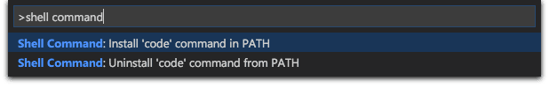
A useful utility that VS code provides us with is the ability to open it from the terminal/command line. To enable this feature, follow the instructions below.
#### MacOs
1. Open Visual Studio Code
2. Press `Cmd + Shift + P` to open the command palette
3. Type `shell command` and select `Shell Command: Install 'code' command in PATH`
4. Restart the terminal
5. You can now open Visual Studio Code from the terminal by typing `code .`

#### Windows
1. Open Visual Studio Code
2. Press `Ctrl + Shift + P` to open the command palette
3. Type `shell command` and select `Shell Command: Install 'code' command in PATH`
4. Restart the terminal
5. You can now open Visual Studio Code from the terminal by typing `code .`


## Install git
Now that we have a text editor installed, we can get to installing git.
### MacOs 
Most versions of MacOS come with git pre-installed. To check if git is installed on your system, open a terminal and run the following command:
```bash
git --version
```
If git is installed, you should see the version number of git.
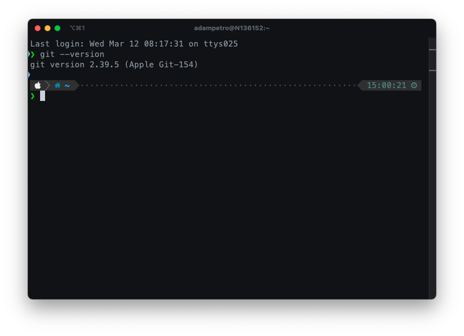

---
If git is not installed, you can install it using the Xcode Command Line Tools.
Apple distributes the official version of git through the Xcode Command Line Tools. Xcode is a Mac development environment for a variety of programming languages, including Swift, Objective-C, and C++. The Command Line Tools package is a small self-contained package available for download separately from Xcode. It enables users to install a variety of development tools, including git, without needing to install the full Xcode package.

To install Xcode Command Line Tools, follow these steps:
1. Open a terminal
2. Run the following command:
```bash
xcode-select --install
```
3. A dialog box will appear asking you to install the command line developer tools. Click on the "Install" button.

Once the installation is complete, you can check if git is installed by running the following command:
```bash
git --version
```
If git is installed, you should see the version number of git.

### Windows
1. Download the latest version of git from [here](https://git-scm.com/download/win)
2. Run the installer
   1. 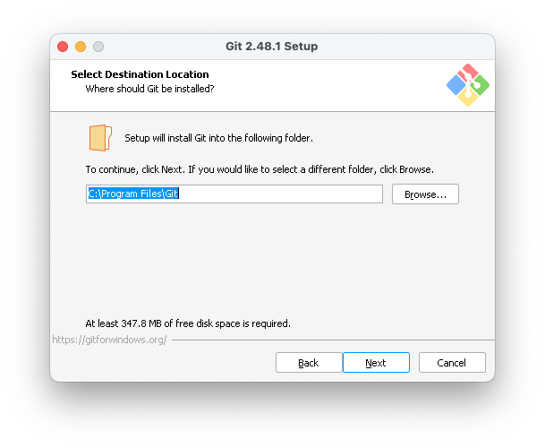 - Keep the default install location.
   2. 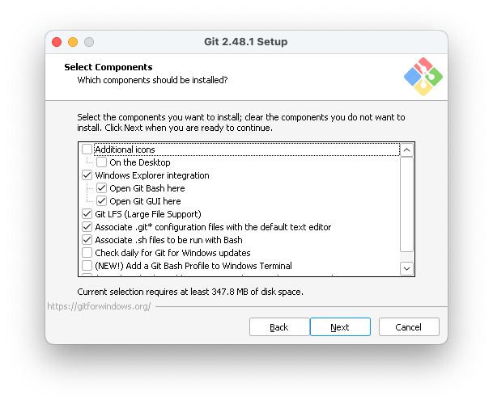 - Keep the default components. Make sure that "Open Git Bash here" is selected.
   3. 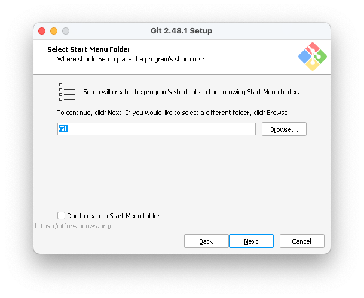 - Keep the default start menu folder settings.
   4. 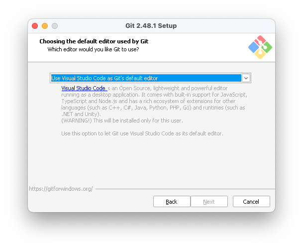 - Use Visual Studio Code as Git's default editor.
   5.  - Let Git decide the initial branch name.
   6. 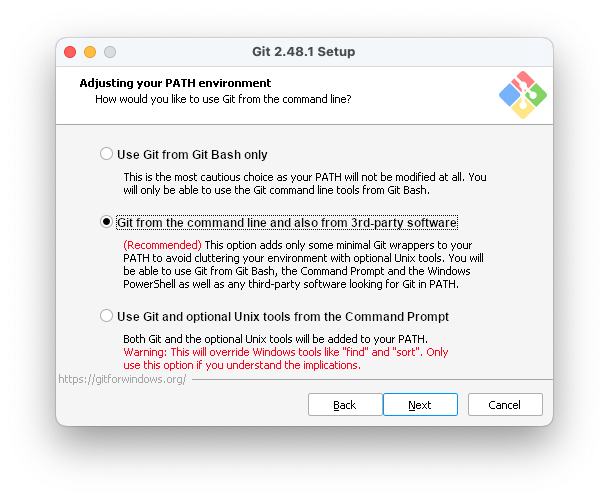 - Git from the command line and also from 3rd-party software.
   7. 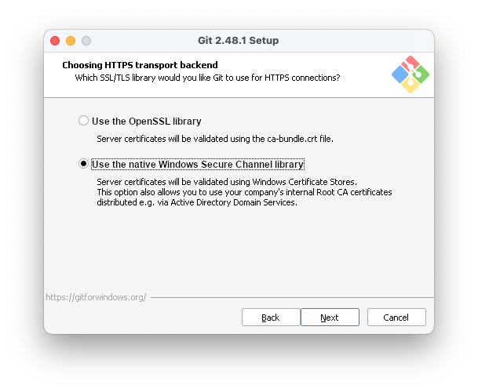 - Use the native Windows Secure Channel library.
   8. 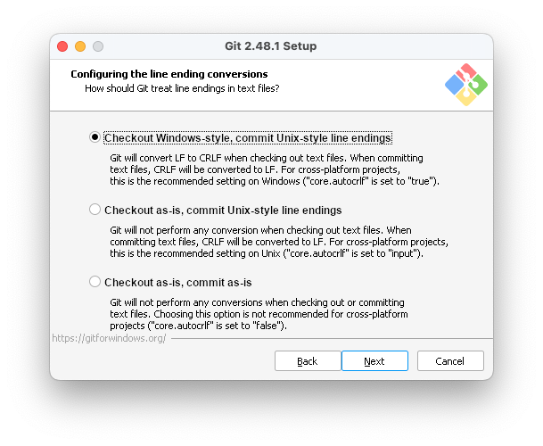 - Keep the default settings for line endings - Checkout Windows-style, commit Unix-style line endings.
   9. 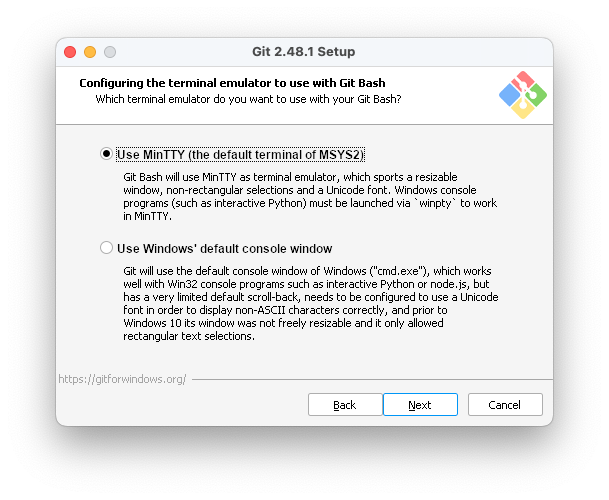 - Keep the default settings for terminal emulator - Use MinTTY.
   10. 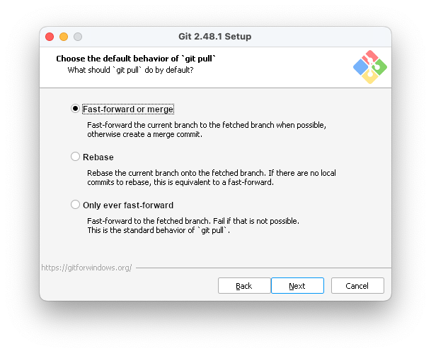 - Keep the default behavior of git pull - Fast forward or merge.
   11. 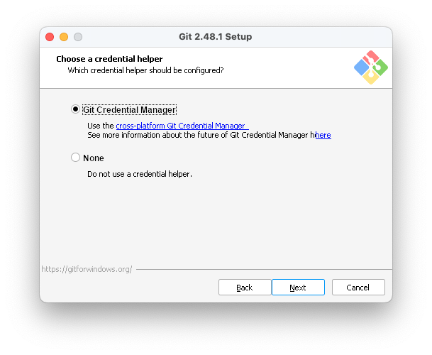 - Keep the default settings for credential helper - Use the Git Credential Manager.
   12. 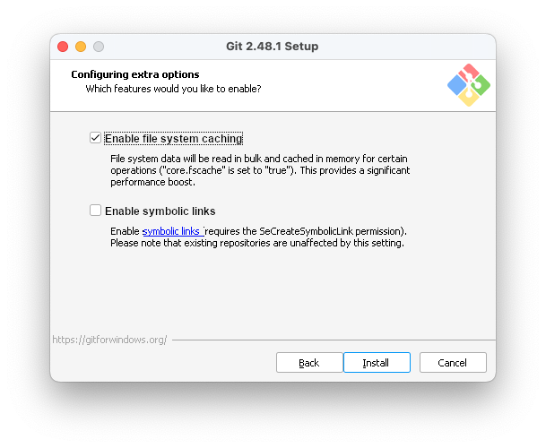 - Keep the default settings for extra options - checked file system caching unchecked symbolic links.
   13. Installation will start.
   14. Finish the installation.
3. Open a command prompt and run the following command:
```bash
git --version
```
If git is installed, you should see the version number of git.


## Create a GitHub account
1. Go to [GitHub](https://github.com).
2. Click on the "Sign up" button.
3. Follow the instructions to create an account.
4. Verify your email address.
5. You now have a GitHub account!